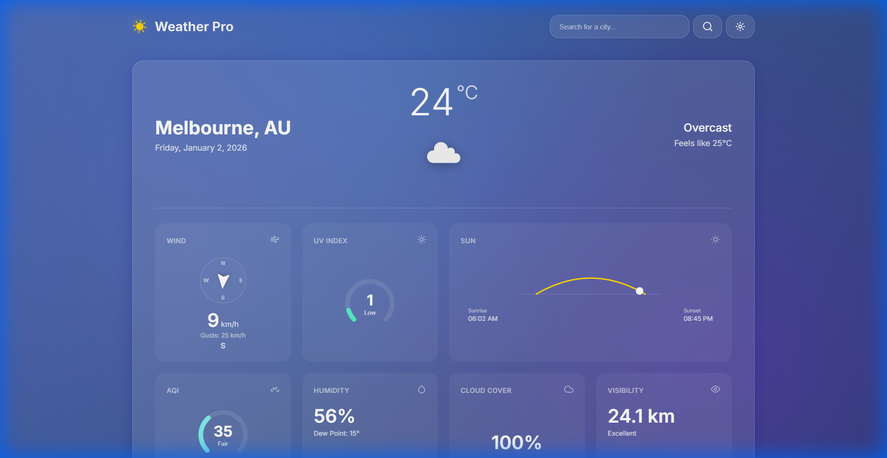
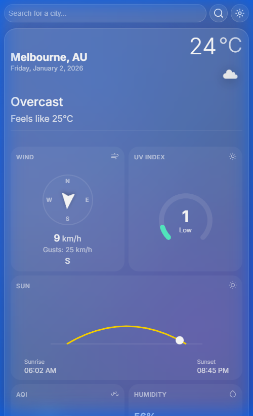
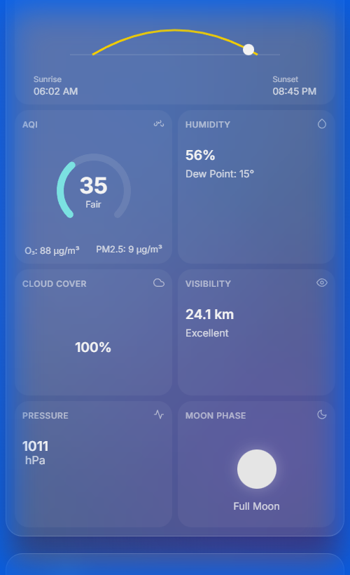
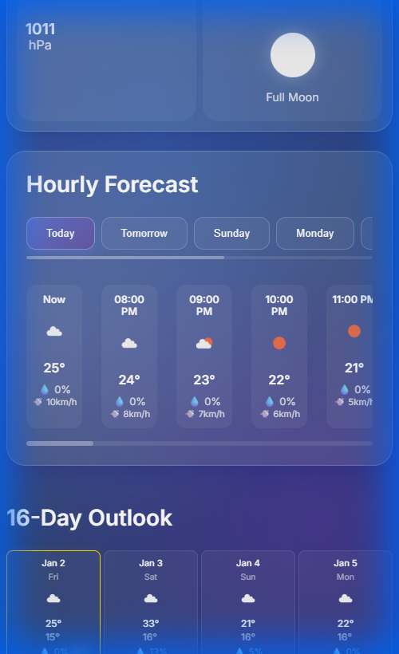

# 🌤️ Weather Pro



<div align="center">

[](https://weather-app.beyondcloud.technology/)
[](LICENSE)
[](https://developer.mozilla.org/en-US/docs/Web/Guide/HTML/HTML5)
[](https://developer.mozilla.org/en-US/docs/Web/CSS)
[](https://developer.mozilla.org/en-US/docs/Web/JavaScript)

### A Modern, Professional Weather Dashboard
**Precision forecasts, extended outlooks, and localized weather data at your fingertips.**

[**Explore the Live Project »**](https://weather-app.beyondcloud.technology/)

</div>

---

## ✨ Features

Experience weather tracking like never before with our feature-rich application:

### 🌍 Real-Time Local Weather
Get instant access to current conditions including:
- **Temperature & "Feels Like"**
- **Wind Speed & Direction**: Real-time compass and gust tracking.
- **Moon Phase**: Accurate current phase and countdown to the next Full Moon (e.g., "12 days to Full Moon").
- **UV Index & Humidity**: With visual gauge indicators.
- **Air Quality Index (AQI)**: Detailed breakdown of pollutants (O3, PM2.5).

### 📱 Extreme Mobile Optimization
Designed for on-the-go usage with a "Thumb-Reach" friendly layout:
- **Dense Grid System**: 2-column detail cards to separate insights without endless scrolling.
- **Vector Scaling**: Dynamic icon scaling (48px primary, 16px details) for crisp visuals on high-res screens.
- **Inline Controls**: Compact search logic to maximize screen real estate.

<div align="center">
  
  
  
</div>

### ⏱️ Smart Hourly Forecast
Plan your day with precision:
- **Instant Start**: Forecast starts immediately from your current local hour ("Now").
- **Wind Data Integration**: Hourly wind speed and direction included directly in the timeline.
- **Intuitive Navigation**: Day buttons automatically update to show actual weekday names (e.g., "Saturday", "Sunday").

### 📅 16-Day Extended Outlook
Look ahead with confidence. Our comprehensive 16-day forecast grid gives you a clear view of temperature trends and precipitation probabilities for the coming weeks.

### ⚡ Auto-Sync & Version Control
Always running the latest version. The application includes a self-updating mechanism that synchronizes with the GitHub repository.
- **Live Version Tracking**: See the exact Git commit ID and deployment time in the footer.

---

## 🚀 Installation & Deployment

Deploy your own instance of Weather Pro in minutes.

### Server Requirements
- **OS**: Ubuntu / Debian (Recommended)
- **Web Server**: NGINX (Preferred) or Apache
- **Permissions**: `sudo` access

### Quick Start (Automated Install)

One command to rule them all. Use our automated installer to set up the environment, configure NGINX, and launch the app.

```bash
# Clone the repository
git clone https://github.com/DeNNiiInc/Weather-App.git
cd Weather-App

# Run the installer (optionally specify a PORT)
# Default is random, or set specific port e.g., 14301
sudo PORT=14301 ./install.sh
```

### Manual Setup
1.  **Clone the Repo**: `git clone https://github.com/DeNNiiInc/Weather-App.git`
2.  **Web Root**: Move files to your web server root (e.g., `/var/www/html/weather-app`).
3.  **Permissions**: Ensure the web user (e.g., `www-data`) has ownership.
4.  **Cron Job**: Setup a cron job for `auto_git_sync.sh` to enable auto-updates.

```bash
*/5 * * * * /path/to/weather-app/auto_git_sync.sh
```

---

## 🛠️ Technology Stack

Built with performance and simplicity in mind, using standard web technologies without heavy framework overhead.

- **Frontend**: HTML5, CSS3 (Variables, Flexbox, Grid), Vanilla JavaScript (ES6+)
- **API**: [Open-Meteo API](https://open-meteo.com/) (No API key required!)
- **Geocoding**: Open-Meteo Geocoding API
- **Icons**: SVG Icons (Feather Icons / Custom)

---

## 🤝 Contributing

Contributions are welcome! If you have suggestions or improvements, please fork the repository and submit a pull request.

1.  Fork the Project
2.  Create your Feature Branch (`git checkout -b feature/AmazingFeature`)
3.  Commit your Changes (`git commit -m 'Add some AmazingFeature'`)
4.  Push to the Branch (`git push origin feature/AmazingFeature`)
5.  Open a Pull Request

---

<div align="center">

**Developed with ❤️ by [Beyond Cloud Technology](https://beyondcloud.technology)**

</div>
